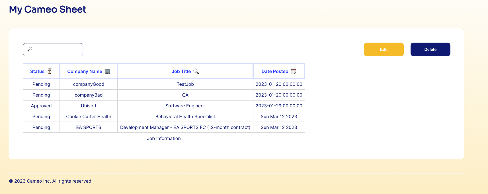
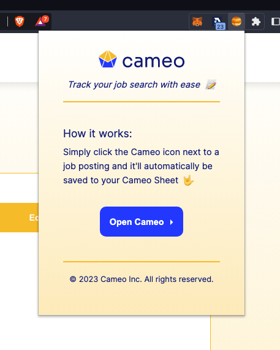
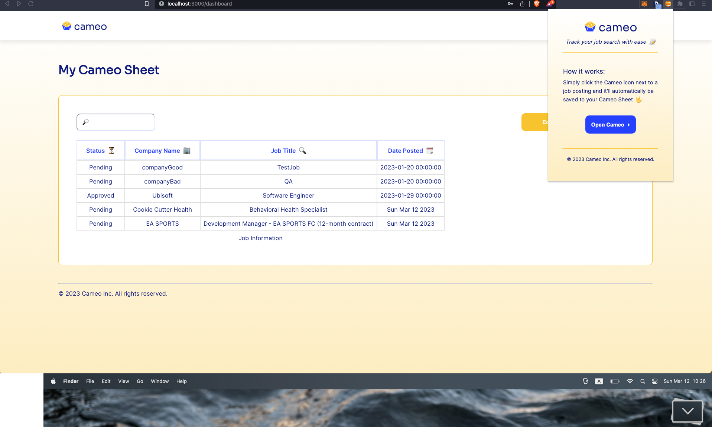

*Track your job search with ease*

Cameo is a browser extension that allows users to scrape job listings from LinkedIn and add them to their personal database. The extension is designed to simplify the process of job hunting by automating the collection and organization of job postings. Once the user has added a job listing to their database, they can view it on the Cameo website, where all of their saved listings are displayed in a table. This feature allows users to easily keep track of their job applications and monitor their progress throughout the hiring process. Overall, Cameo provides a convenient and efficient solution for job seekers who want to streamline their job search and stay organized.

****

#### Dashboard


#### Pop up


#### Full View



**Directory**

```html
├── client
│   ├── README.md
│   ├── package-lock.json
│   ├── package.json
│   ├── public
│   │   ├── favicon.ico
│   │   ├── index.html
│   │   ├── logo192.png
│   │   ├── logo512.png
│   │   ├── manifest.json
│   │   └── robots.txt
│   ├── src
│   │   ├── App.css
│   │   ├── App.tsx
│   │   ├── components
│   │   │   ├── Dashboard.tsx
│   │   │   ├── Login.tsx
│   │   │   ├── PrivateRoute.tsx
│   │   │   └── SignUp.tsx
│   │   ├── index.css
│   │   ├── index.tsx
│   │   ├── react-app-env.d.ts
│   │   ├── reportWebVitals.ts
│   │   └── services
│   │       └── Auth.ts
│   └── tsconfig.json
├── ext
│   ├── README.md
│   ├── build
│   │   ├── background.js
│   │   ├── contentScript.js
│   │   ├── contentScript.js.map
│   │   ├── extensionLogin.js
│   │   ├── extensionLogin.js.map
│   │   ├── icons
│   │   │   ├── cameo-icon-variation.svg
│   │   │   ├── cameo-icon.svg
│   │   │   ├── cameo-logo-final.svg
│   │   │   ├── cameo-logo-minified.svg
│   │   │   ├── cameo-logo.svg
│   │   │   ├── icon_128.png
│   │   │   ├── icon_16.png
│   │   │   ├── icon_32.png
│   │   │   └── icon_48.png
│   │   ├── login.html
│   │   ├── manifest.json
│   │   ├── popup.css
│   │   ├── popup.html
│   │   ├── popup.js
│   │   ├── popup.js.map
│   │   └── styles.css
│   ├── config
│   │   ├── paths.js
│   │   ├── webpack.common.js
│   │   └── webpack.config.js
│   ├── package-lock.json
│   ├── package.json
│   ├── public
│   │   ├── icons
│   │   │   ├── cameo-icon-variation.svg
│   │   │   ├── cameo-icon.svg
│   │   │   ├── cameo-logo-final.svg
│   │   │   ├── cameo-logo-minified.svg
│   │   │   ├── cameo-logo.svg
│   │   │   ├── icon_128.png
│   │   │   ├── icon_16.png
│   │   │   ├── icon_32.png
│   │   │   └── icon_48.png
│   │   ├── login.html
│   │   ├── manifest.json
│   │   ├── popup.css
│   │   ├── popup.html
│   │   └── styles.css
│   ├── src
│   │   ├── background.js
│   │   ├── contentScript.js
│   │   ├── extensionLogin.js
│   │   ├── popup.js
│   │   └── request.js
│   └── tsconfig.json
├── icons
│   ├── cameo-icon-variation.svg
│   ├── cameo-icon.svg
│   ├── cameo-logo-final.svg
│   ├── cameo-logo-minified.svg
│   ├── cameo-logo.svg
│   ├── icon_128.png
│   ├── icon_16.png
│   ├── icon_32.png
│   └── icon_48.png
├── readme.md
└── server
    ├── package-lock.json
    ├── package.json
    ├── src
    │   ├── controllers
    │   │   ├── auth.ts
    │   │   ├── home.ts
    │   │   ├── index.ts
    │   │   ├── job.ts
    │   │   └── types.ts
    │   ├── database
    │   │   ├── index.ts
    │   │   └── types.ts
    │   ├── index.ts
    │   ├── routes
    │   │   ├── api.ts
    │   │   ├── base.ts
    │   │   ├── catch.ts
    │   │   ├── home.ts
    │   │   └── index.ts
    │   └── server.ts
    └── tsconfig.json
```
